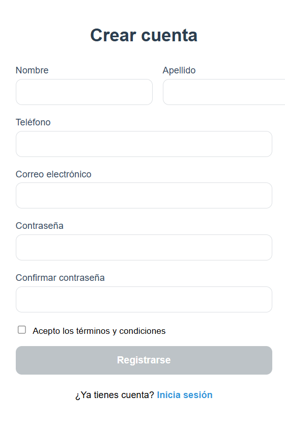
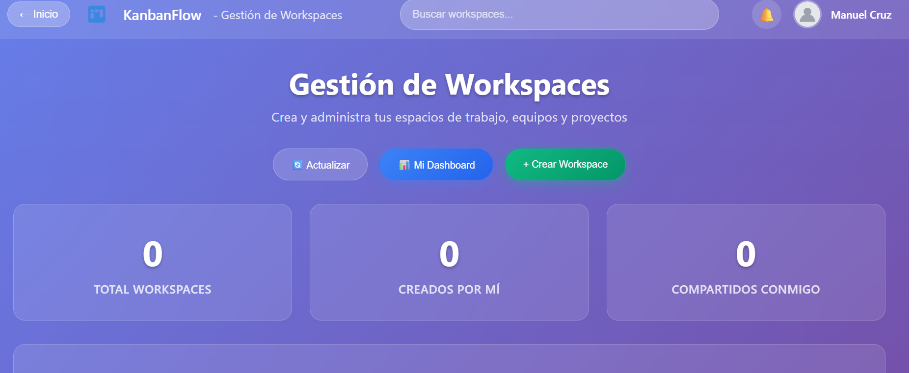
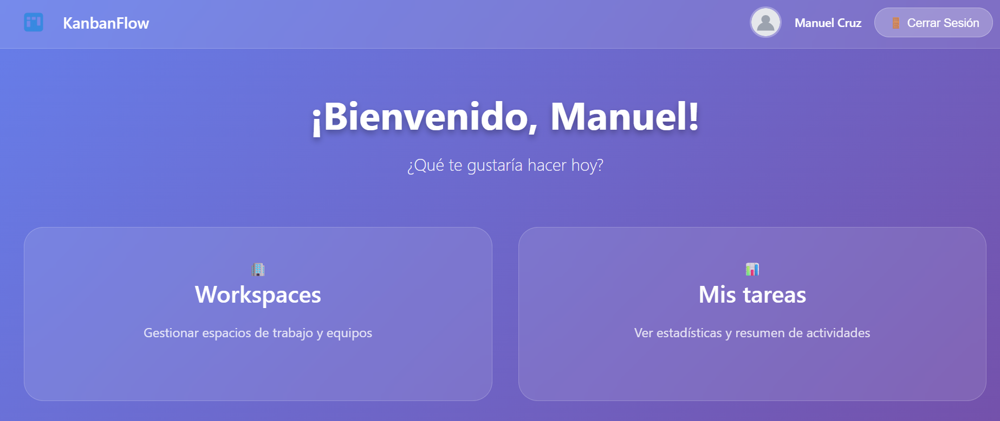
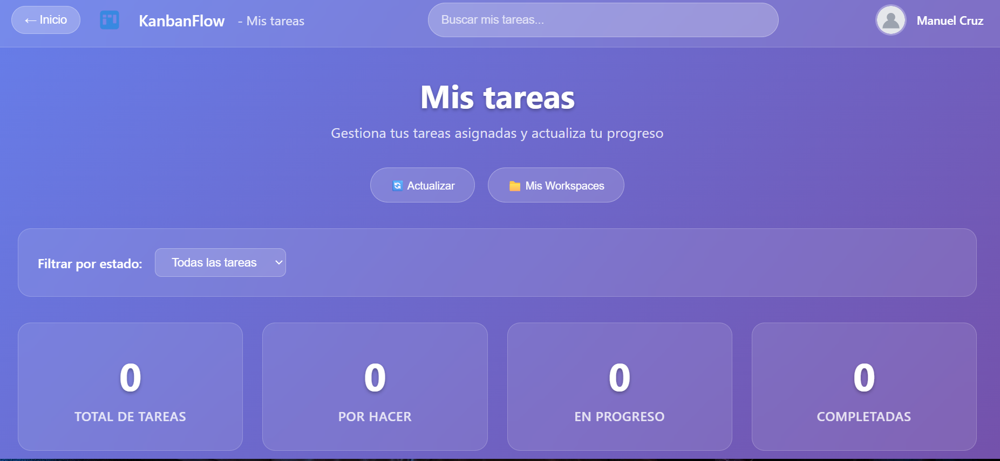

# ProyectoFinal
# Sistema KanbanFlow - Gestión de Tareas y Equipos

Una aplicación web completa de gestión de proyectos colaborativos con frontend Angular 20+ y backend Laravel, permitiendo la administración de workspaces, equipos y tareas con diferentes niveles de permisos.

## Equipo2

### Integrantes
- **José Manuel Cruz Cristales** - Desarrollador 
- **Alejandro Valencia Tenorio** - Desarrollador 

---

## 1. Descripción del Proyecto

Este sistema Kanban tiene como objetivo crear una plataforma completa de gestión de proyectos colaborativos, donde los usuarios pueden crear espacios de trabajo, formar equipos y asignar tareas con diferentes niveles de permisos.

### Tecnologías utilizadas

#### Frontend (Angular)
- **Angular 20+** con arquitectura standalone
- **TypeScript**
- **SCSS** con diseño glassmorphism
- **JWT** para autenticación
- **Responsive Design**

#### Backend (Laravel)
- **Laravel 12.x**  
- **PHP 8.2+**
- **Laravel Sanctum** para autenticación API
- **MySQL/PostgreSQL** para base de datos
- **Eloquent ORM** para manejo de datos

---

## 2. Funcionalidades Clave

### Proceso de Logueo



El sistema implementa un proceso de autenticación completo:

**Frontend (Angular):**
- Formularios reactivos con validaciones en tiempo real
- JWT Token Management con interceptores HTTP
- Guards de autenticación para protección de rutas
- Sesión persistente con localStorage

**Backend (Laravel):**
- Registro de usuarios con validaciones robustas
- Login seguro con generación de tokens JWT
- Middleware de autenticación para protección de rutas
- Logout con eliminación de tokens activos

```bash
# Registro de usuario
POST /api/register
{
  "first_name": "Juan",
  "last_name": "Pérez", 
  "email": "juan@email.com",
  "password": "123456",
  "password_confirmation": "123456"
}

# Login para obtener token
POST /api/login
{
  "email": "juan@email.com",
  "password": "123456"
}
```

### Niveles de usuario | Rol

| Rol | Permisos | Descripción |
|-----|----------|-------------|
| **Creador de Workspace** | ✅ Puede crear/editar/eliminar workspace<br>✅ Puede crear equipos dentro del workspace<br>✅ Ve todas las tareas del workspace<br>❌ No puede gestionar miembros de equipos | Propietario del espacio de trabajo |
| **Líder de Equipo** | ✅ Puede agregar/quitar miembros del equipo<br>✅ Puede crear/editar/eliminar tareas<br>✅ Puede cambiar TODO en las tareas<br>✅ Ve todas las tareas del equipo | Administrador del equipo |
| **Miembro de Equipo** | ✅ Ve solo sus tareas asignadas<br>✅ Puede actualizar progress e is_done de sus tareas<br>❌ NO puede crear/eliminar tareas<br>❌ NO puede gestionar miembros | Usuario colaborador |

### CRUD de usuarios

**Operaciones disponibles:**
- **Crear**: Registro completo con validaciones (nombre, apellido, email, teléfono)
- **Leer**: Listado de usuarios para asignaciones y perfil personal
- **Actualizar**: Modificación de datos de perfil
- **Eliminar**: Gestión de usuarios inactivos

**Endpoints:**
```bash
POST /api/register     # Crear usuario
GET  /api/users        # Listar usuarios
GET  /api/user         # Perfil del usuario autenticado
POST /api/logout       # Eliminar sesión activa
```

### CRUD de Workspaces



**Operaciones de Espacios de Trabajo:**
- **Crear**: Nuevos espacios con nombre y descripción
- **Leer**: Vista de workspaces con estadísticas
- **Actualizar**: Modificación de información del workspace
- **Eliminar**: Eliminación con cascada de equipos y tareas

**Endpoints:**
```bash
GET    /api/workspaces           # Lista workspaces del usuario
POST   /api/workspaces           # Crear nuevo workspace
GET    /api/workspaces/{id}      # Ver workspace específico
PUT    /api/workspaces/{id}      # Actualizar workspace
DELETE /api/workspaces/{id}      # Eliminar workspace
GET    /api/workspaces/{id}/tasks # Ver tareas del workspace
```

### Proceso principal: Gestión Colaborativa de Tareas



El proceso principal del sistema es la **gestión colaborativa de tareas** mediante tableros Kanban:

1. **Creación de Workspace** → El líder establece el proyecto
2. **Formación de Equipos** → Se agregan miembros con roles específicos
3. **Asignación de Tareas** → Los líderes crean y asignan tareas
4. **Seguimiento Visual** → Tablero Kanban con columnas de estado:
   - **Pendiente** (0-25% progreso)
   - **En Progreso** (26-75% progreso)
   - **Completado** (76-100% progreso)
5. **Actualización Colaborativa** → Los miembros actualizan el progreso
6. **Finalización** → Marcado como completado



**Dashboard Personal:**
Cada usuario cuenta con un panel personalizado que muestra:
- Estadísticas de tareas asignadas
- Filtros por estado de progreso
- Información del equipo
- Historial de actividades

### Envío de correo electrónico con PDF adjunto

**Librería Utilizada**: Laravel Mail + DomPDF

El sistema utiliza `barryvdh/laravel-dompdf` para la generación de reportes PDF y Laravel Mail para el envío de correos electrónicos.

**Implementación:**

```php
// Configuración en composer.json
"barryvdh/laravel-dompdf": "^3.0"

// Generación de PDF de reportes
use Barryvdh\DomPDF\Facade\Pdf;
use Illuminate\Support\Facades\Mail;

public function generateTaskReport($workspaceId) {
    $tasks = Task::where('workspace_id', $workspaceId)
                 ->with(['assignedUser', 'creator'])
                 ->get();
    
    $pdf = PDF::loadView('reports.tasks', compact('tasks'));
    
    Mail::to($user->email)->send(
        new TaskReportMail($pdf->output())
    );
}
```

**Vista Blade para PDF:**
```html
<!DOCTYPE html>
<html>
<head>
    <style>
        body { font-family: Arial, sans-serif; }
        .header { background: #4f46e5; color: white; }
        .task-item { border: 1px solid #ccc; margin: 10px 0; }
    </style>
</head>
<body>
    <div class="header">
        <h1>Reporte de Tareas - {{ $workspace->name }}</h1>
    </div>
    @foreach($tasks as $task)
        <div class="task-item">
            <h3>{{ $task->title }}</h3>
            <p>Progreso: {{ $task->progress }}%</p>
            <p>Asignado a: {{ $task->assignedUser->first_name }}</p>
        </div>
    @endforeach
</body>
</html>
```

**Configuración de Email (.env):**
```env
MAIL_MAILER=smtp
MAIL_HOST=smtp.gmail.com
MAIL_PORT=587
MAIL_USERNAME=your-email@gmail.com
MAIL_PASSWORD=your-app-password
MAIL_ENCRYPTION=tls
```

### Otras funcionalidades únicas del proyecto

**Frontend Angular:**
- **Diseño Glassmorphism**: Interfaz moderna con efectos de cristal
- **Arquitectura Standalone**: Angular 20+ con componentes independientes
- **Responsive Design**: Adaptable a todos los dispositivos
- **Validaciones en Tiempo Real**: Feedback inmediato al usuario
- **Sistema de Filtros**: Filtrado dinámico de tareas por estado

**Backend Laravel:**
- **Middleware Personalizado**: Verificación de roles por endpoint
- **Validaciones Granulares**: Form Requests personalizados
- **Relaciones Eloquent Optimizadas**: Eager loading para mejor performance
- **Respuestas Consistentes**: Formato JSON unificado
- **Manejo de Errores Centralizado**: Exception Handler personalizado

---

## 3. APIs Laravel y consumo de las mismas

### Endpoints Principales de la API

#### Autenticación
```http
POST /api/register     # Registro de usuarios
POST /api/login        # Inicio de sesión  
POST /api/logout       # Cierre de sesión
GET  /api/users        # Lista usuarios
```

#### Workspaces
```http
GET    /api/workspaces           # Lista workspaces
POST   /api/workspaces           # Crear workspace
GET    /api/workspaces/{id}      # Ver workspace
PUT    /api/workspaces/{id}      # Actualizar
DELETE /api/workspaces/{id}      # Eliminar
```

#### Teams
```http
GET    /api/teams                # Lista equipos
POST   /api/teams                # Crear equipo
POST   /api/teams/{id}/add-member # Agregar miembro
DELETE /api/teams/{id}/remove-member/{userId} # Quitar miembro
```

#### Tasks
```http
GET    /api/tasks       # Lista tareas asignadas
POST   /api/tasks       # Crear nueva tarea
PUT    /api/tasks/{id}  # Actualizar tarea
DELETE /api/tasks/{id}  # Eliminar tarea
```

### Consumo desde Angular

#### AuthService
```typescript
@Injectable({ providedIn: 'root' })
export class AuthService {
  private apiUrl = 'http://localhost:8000/api';

  login(credentials: LoginData): Observable<AuthResponse> {
    return this.http.post<AuthResponse>(`${this.apiUrl}/login`, credentials)
      .pipe(
        tap(response => {
          localStorage.setItem('token', response.token);
          localStorage.setItem('user', JSON.stringify(response.user));
        }),
        catchError(this.handleError)
      );
  }
}
```

#### TaskService
```typescript
@Injectable({ providedIn: 'root' })
export class TaskService {
  getUserTasks(): Observable<Task[]> {
    return this.http.get<Task[]>(`${this.apiUrl}/tasks`, {
      headers: this.authService.getAuthHeaders()
    });
  }

  updateTask(id: number, data: UpdateTaskData): Observable<any> {
    return this.http.put(`${this.apiUrl}/tasks/${id}`, data, {
      headers: this.authService.getAuthHeaders()
    });
  }
}
```

#### Interceptor de Autenticación
```typescript
@Injectable()
export class AuthInterceptor implements HttpInterceptor {
  intercept(req: HttpRequest<any>, next: HttpHandler): Observable<HttpEvent<any>> {
    const token = localStorage.getItem('token');
    if (token) {
      req = req.clone({
        setHeaders: { Authorization: `Bearer ${token}` }
      });
    }
    return next.handle(req);
  }
}
```

### Flujo de Trabajo con API

```bash
# PASO 1: Crear workspace
POST /api/workspaces
{ 
  "name": "Mi Proyecto", 
  "description": "Descripción del proyecto" 
}

# PASO 2: Crear equipo
POST /api/teams
{ 
  "name": "Frontend Team", 
  "workspace_id": 1 
}

# PASO 3: Agregar miembros
POST /api/teams/1/add-member
{ 
  "user_id": 2, 
  "role": "member" 
}

# PASO 4: Crear tareas
POST /api/tasks
{ 
  "title": "Implementar login",
  "description": "Crear pantalla de autenticación",
  "workspace_id": 1,
  "team_id": 1, 
  "assigned_to": 2
}

# PASO 5: Actualizar progreso
PUT /api/tasks/1
{ 
  "progress": 50, 
  "is_done": false 
}
```

---

## 4. Dependencias y Configuración

### Requisitos mínimos para poner en marcha el proyecto

#### Backend (Laravel)
- **PHP**: 8.2 o superior
- **Composer**: 2.5 o superior
- **Base de Datos**: MySQL 8.0 / MariaDB 10.6 / PostgreSQL 13
- **Memoria**: 512MB RAM mínimo
- **Almacenamiento**: 500MB libres

#### Frontend (Angular)
- **Node.js**: 18.0 o superior
- **npm**: 9.0 o superior
- **Angular CLI**: 20.0 o superior
- **TypeScript**: 5.0 o superior

#### Servidor Web
- **Apache**: 2.4 o superior
- **Nginx**: 1.18 o superior

### Instalación y Configuración

#### 1. Backend Laravel (laraApp)
```bash
# Clonar repositorio
git clone [URL_REPOSITORIO]
cd laraApp

# Instalar dependencias
composer install

# Configurar ambiente
cp .env.example .env

# Configuración de base de datos (.env)
DB_CONNECTION=mysql
DB_HOST=127.0.0.1
DB_PORT=3306
DB_DATABASE=kanbanflow_db
DB_USERNAME=root
DB_PASSWORD=

# Generar clave y migrar
php artisan key:generate
php artisan migrate

# Iniciar servidor
php artisan serve
```

#### 2. Frontend Angular (login-app)
```bash
# Navegar al directorio frontend
cd login-app

# Instalar dependencias
npm install

# Configurar entorno
# Editar src/environments/environment.ts
export const environment = {
  production: false,
  apiUrl: 'http://localhost:8000/api'
};

# Iniciar servidor de desarrollo
ng serve
# Disponible en: http://localhost:4200
```

### Dependencias Principales

#### Laravel (Backend)
```json
{
  "require": {
    "php": "^8.2",
    "laravel/framework": "^12.0",
    "laravel/sanctum": "^4.0",
    "barryvdh/laravel-dompdf": "^3.0"
  }
}
```

#### Angular (Frontend)
```json
{
  "dependencies": {
    "@angular/core": "^20.0.0",
    "@angular/common": "^20.0.0",
    "@angular/router": "^20.0.0",
    "@angular/forms": "^20.0.0",
    "@angular/material": "^19.0.0"
  }
}
```

### Estructura del Proyecto

```
ProyectoFinal/
├── laraApp/          # Backend Laravel API
├── login-app/        # Frontend Angular
└── README.md         # Documentación principal
```

Para más detalles específicos de cada componente:
- [Documentación Backend Laravel](./laraApp/README.md)
- [Documentación Frontend Angular](./login-app/README.md)

